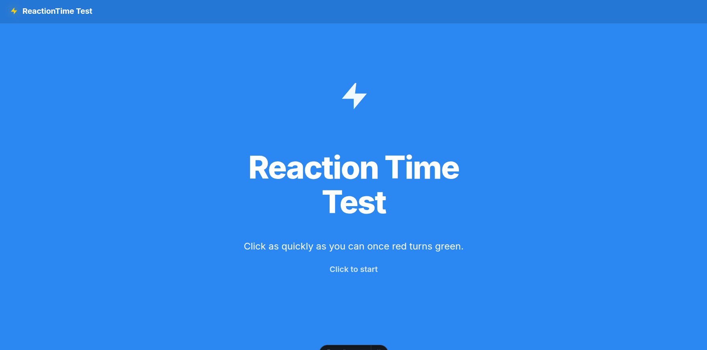

# Reaction Time Test

A web-based reaction time test application built with Astro.

## <p align="center">Display</p> 



## Tech Stack

- **Framework:** Astro
- **Styling:** Vanilla CSS
- **Scripting:** TypeScript

## Project Structure
The project has the following file layout:

```text
/
├── public/
│   ├── favicon.ico
│   └── favicon.svg
├── src/
│   ├── components/
│   │   ├── Navbar.astro       # Top navigation bar
│   │   └── Reactiontime.astro # Main reaction time test component and game loop
│   ├── layouts/
│   │   └── Layout.astro       # Base HTML document template
│   ├── pages/
│   │   └── index.astro        # Home page rendering the test
│   └── styles/
│       └── global.css         # Global CSS style variables and resets
├── package.json
└── tsconfig.json
```

## How It Works

The game loop transitions through five distinct states:

1. **Idle (`data-state="idle"`)**: The default starting state.
2. **Waiting (`data-state="waiting"`)**: The screen turns red. A random delay of 1 to 4 seconds is set.
3. **Go (`data-state="go"`)**: The screen turns green. The timer starts.
4. **Too Soon (`data-state="too-soon"`)**: Triggered if Spacebar is pressed before the screen turns green.
5. **Result (`data-state="result"`)**: Displays the recorded response time in milliseconds.

### Input Latency Minimization

Input is registered via a `keydown` listener listening for the `Space` key. It uses `performance.now()` immediately upon keydown to capture the timestamp, comparing it to the timestamp when the screen turned green to test the user's Reaction time. 

## Setup and Commands

All commands should be executed from the project root.

### Installation

Install the project dependencies:

```bash
npm install
```

### Development Server

Start a local development server with hot-reloading at `http://localhost:4321`:

```bash
npm run dev
```

### Build

Compile the project for production. The output will be generated in the `dist` directory:

```bash
npm run build
```

### Preview

Preview the production build locally before deployment:

```bash
npm run preview
```
---

Made with 🩵 by [AaravAtGit](https://github.com/AaravAtGit/).